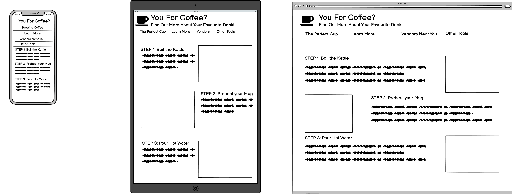

# *You For Coffee?* - A Dedication to Coffee 
  - [*You For Coffee?* - A Dedication to Coffee](#you-for-coffee---a-dedication-to-coffee)
  - [Introduction](#introduction)
  - [UX](#ux)
    - [Project Goals](#project-goals)
    - [Customer Goals](#customer-goals)
    - [Developer Goals](#developer-goals)
    - [User Stories](#user-stories)
    - [Design Goals](#design-goals)
    - [Wireframes](#wireframes)
  - [Features](#features)
    - [Implemented](#implemented)
    - [Planned](#planned)
  - [Testing](#testing)
    - [During Development](#during-development)
    - [Browsers](#browsers)
    - [Other Devices](#other-devices)
  - [Deployment](#deployment)
    - [Deployment Locally](#deployment-locally)
    - [Deployment on Github Pages](#deployment-on-github-pages)
  - [Credits](#credits)
    - [Table of Contents Layout](#table-of-contents-layout)
    - [Navbar Layout](#navbar-layout)
    - [Colour Palette](#colour-palette)
    - [Images](#images)

## Introduction

*You For Coffee?* is inspired by the relatively recent but significant rise in coffee culture in Ireland. It is created to help educate visitors on some good methods to create a good cup of coffee, while providing resources to educate, and finally some links to some of the fantastic coffee roasters found around the country.

## UX

### Project Goals

Create a website educating visitors about the beverage of coffee.

### Customer Goals

- To find out how to make a good cup of coffee using beans or ground beans.
- To learn some info about the coffee drink, its history and its culture.
- To figure out where customers could purchase local coffee from irish roasteries.

### Developer Goals

To create a well-structured informative website that provides some useful, practical information in a pleasant visual format, laid out into separate pages to avoid cognitive overload.

### User Stories
- I want a simple guide to make a cup of coffee, because I do not know how to best make coffee
- I want a navigation tool to easily get to each page, because I do not want to click several links to get the information I need
- I want a visually pleasing webpage, so that I do not get bored easily
- I want to learn more about where coffee originated from, because I am curious where the beverage comes from
- I want to know if there are any health benefits to drinking coffee, because I now often drink coffee
- I want to learn more about coffee culture in Ireland, because I am seeing more evidence of it in my locality
- I want to know where I can buy coffee, so that I can make a purchase
- I want to know if I can buy coffee in Ireland, so that I can make a purchase
- I want to know where in Ireland coffee can be bought, so that I can make a purchase
- I want to know if there is an easy way to make coffee, because I have a small budget and would still like to enjoy coffee
- I want to find all the different ways to make coffee, so that I can choose one

### Design Goals

- Consistent header across all pages to encourage clear branding, and remind visitors that they are still on the same website.
- Comfortable colour scheme that would not stress viewers who might be accustomed to viewing webpages at night, and are sensitive to overly bright webpages.

### Wireframes

Below is a wireframe showing the basic layout that was decided upon before the coding began. This was created in the balsamiq tool.



## Features

### Implemented

- Simple navbar that allows one-click navigation across all webpages, consistent design on all webpages to support first-time learning.

### Planned

- Step-by-step instructions with pictures on how to create 'the perfect cup of coffee'
- A simple summary document that gives the steps required to make The Perfect Cup. This would be a pdf one page doc that can be downloaded and printed out by a visitor, to stick on    a fridge or near the kettle.


- A page with separate sections for:
    - Coffee: a Brief History
    - Coffee Culture
    - The Health Benefits of Moderate Coffee Consumption

- A map of ireland with locations for a number of irish roasteries.

- A bootstrap carousel for the various other methods available for making coffee, with pictures, captions and links.

## Testing

### During Development
* Site was tested using Chrome Developer Tools during development
  * Ensured that padding and margins were behaving as expected from styles.css
  * Ensured images were resizing correctly at different resolutions
  * Tested responsiveness by using the *Responsive Design Mode* feature to simulate the layout on various devices like iphone 6, iPads or Samsung Galaxys
  * Investigated and examined unwanted issues in the html and css using the developer tools to show attributes of various elements when they are displayed on the page, in order to fix them in the source code.
  * Examined the bootstrap features to ensure that there were no issues with tags inherited from bootstrap  on all pages
  * Cross examined elements to ensure bootstrap was not overriding user stylesheet on all pages
### Browsers
* Google Chrome - tested each page individually for all tests below
  * Tested layout on normal desktop resolution
  * Tested responsiveness by resizing the window and ensuring there was no overlap of elements or misalignment of content on page
  * Tested all links to ensure functionality as expected
* Firefox - tested each page individually for all tests below
  * Tested layout on normal desktop resolution
  * Tested responsiveness by resizing the window and ensuring there was no overlap of elements or misalignment of content on page
  * Tested all links to ensure functionality as expected
* Safari - tested each page individually for all tests below
  * Tested layout on normal desktop resolution
  * Tested responsiveness by resizing the window and ensuring there was no overlap of elements or misalignment of content on page
  * Tested all links to ensure functionality as expected

### Other Devices
* iPhone 8 - tested each page individually for all tests below
  * Examined each page to ensure all pages were clear and readable on the device
  * Tested site in horizontal read mode. The width of the the screen reduced readability slightly but I believe this is due to the narrow width of the device rather than an issue that can be addressed in the web design.
  * Tested all links to ensure functionality as expected
* Samsung Galaxy A20e - tested each page individually for all tests below
  * Examined each page to ensure all pages were clear and readable on the device
  * Tested site in horizontal read mode. The width of the the screen reduced readability slightly but I believe this is due to the narrow width of the device rather than an issue that can be addressed in the web design.
  * Tested all links to ensure functionality as expected
* Amazon Fire 10 - tested each page individually for all tests below
  * Examined each page to ensure all pages were clear and readable on the device
  * Tested site in horizontal read mode. On the tablet the readability was not affected to any major degree
  * Tested all links to ensure functionality as expected

## Deployment

### Deployment Locally

During testing, the website was deployed locally using the below command:

```
python3 -m http.server
```

### Deployment on Github Pages

In order to host the website on Github Pages, I needed to update the settings in the repo on Github.com, then enable the Github Pages feature for the master branch. I noticed that none of my images were loading correctly, and updated the relative paths in the html so that they would load without issue.

There was some confusion here caused by the slight delay from pushing a new version of the source code to the master branch, and these changes being shown in the deployed website, but this was otherwise quite straightforward.

## Credits 

### Table of Contents Layout

The table of contents used in this readme was heavily inspired by the example given in the Code Institute videos for this module, as I felt they covered all the requirements for a solid readme design. 

### Navbar Layout

The layout of the header and navbar was heavily inspired by the resume project done in the User-Centric Design module, as it was a clean and feature-rich example of what can be achieved with bootstrap. 

### Colour Palette

The colour palette was heavily inspired by the great website [coolors.co](https://coolors.co/), which provided some great examples of colours that worked well together, to help find the theme that was suitable for the site.

### Images

All images have been credited to their respective owners, and links can be found attached to all images, linking to the original owner.